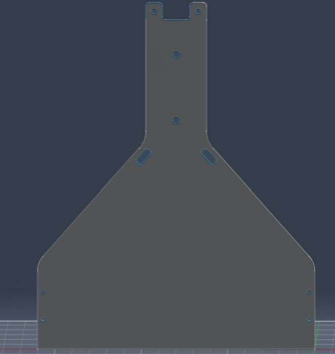
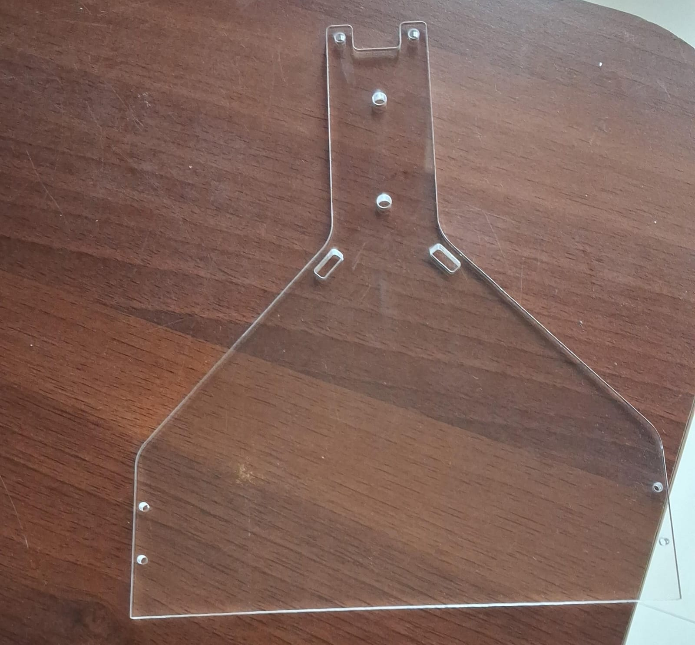
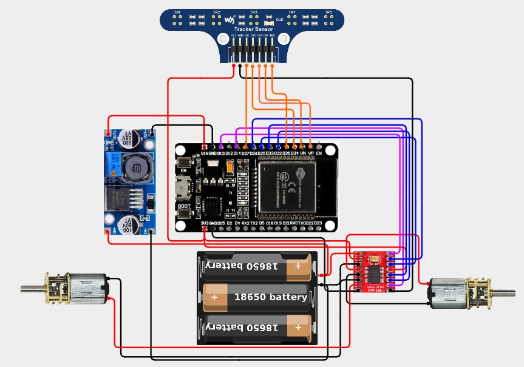

# 🤖 Line-Following Bot — Autonomous PID-Controlled Line Tracker

> An autonomous line-following robot built on the **ESP32**, using a **5-channel IR sensor array** and a **PID control loop** for smooth, adaptive path tracking — including recovery from small gaps and complete line loss.


-00979D)


---

## 📖 Table of Contents

1. [Abstract](#-abstract)
2. [Key Features](#-key-features)
3. [System Architecture](#-system-architecture)
4. [Hardware Components](#-hardware-components)
5. [Pin Diagrams & Wiring](#-pin-diagrams--wiring)
6. [Power Design & Calculations](#-power-design--calculations)
7. [Software Stack](#-software-stack)
8. [Getting Started](#-getting-started)
9. [Firmware Overview](#-firmware-overview)
10. [Control Algorithm Details](#-control-algorithm-details)
11. [Calibration](#-calibration)
12. [Chassis Design](#-chassis-design)
13. [Results](#-results)
14. [Known Limitations & Future Work](#-known-limitations--future-work)
15. [Abbreviations](#-abbreviations)
---

## 🧾 Abstract

This project implements an **autonomous line-following robot** using an **ESP32** microcontroller, a **5-channel IR reflectance sensor array**, and a **TB6612FNG dual motor driver**. A closed-loop **PID (Proportional–Integral–Derivative) controller** continuously computes a weighted position error from the sensor array and translates it into differential motor speeds, allowing the bot to smoothly track a line, correct drift, and navigate curves.

The system also includes **gap-tolerance logic** (to glide over short broken segments of the line) and a **line-recovery routine** (pivoting toward the last known error direction when the line is completely lost). The chassis is a fully custom design, modeled in **Fusion 360**.

---

<p align="center">
  
  
</p>

---

## ✨ Key Features

| Feature | Description |
|---|---|
| 🎯 **Weighted Error Calculation** | 5 IR sensors mapped to weights `{-2,-1,0,1,2}` produce a continuous position error, not just discrete on/off states |
| 🧮 **Full PID Control Loop** | Proportional, Integral, and Derivative terms combine to produce smooth, non-oscillatory corrections |
| ⚙️ **Differential Motor Speed Control** | Left/right motor speeds are independently adjusted via PWM based on the computed correction |
| 🕳️ **Gap Tolerance** | Bot continues straight through short line breaks (< 50 ms) instead of veering off |
| 🔄 **Line-Recovery Pivot** | If the line is lost beyond the gap tolerance, the bot pivots in the direction of the last known error until it reacquires the line |
| 🔋 **Isolated Power Domains** | Battery pack powers the motor driver directly; a buck converter steps down voltage for the ESP32 logic rail |
| 🧩 **Custom Chassis** | Fully custom-modeled chassis designed in Fusion 360, exported as DXF for fabrication |

---

## 🏗️ System Architecture

```
┌────────────────────┐        Analog Voltage (x5)        ┌──────────────────────┐
│  IR Tracker Module   │ ──────────────────────────────▶ │        ESP32          │
│  (5 x IR Sensors)     │                                  │  (PID Control Logic)  │
└────────────────────┘                                    └──────────┬───────────┘
                                                                       │ PWM + Direction Pins
                                                                       ▼
                                                          ┌────────────────────────┐
                                                          │     TB6612FNG            │
                                                          │   Dual Motor Driver      │
                                                          └───────────┬────────────┘
                                                                      │
                                                        ┌─────────────┴─────────────┐
                                                        ▼                           ▼
                                                 N20 Motor (Left)           N20 Motor (Right)
```

**Data flow summary:**
1. The 5-channel IR array reads analog reflectance values off the track surface.
2. Each reading is thresholded into a binary state (`0` = WHITE, `1` = BLACK / line).
3. Binary states are multiplied by positional weights and averaged to compute a single `error` value representing the bot's offset from the line's center.
4. The `error` is fed through the PID formula to compute a `correction` term.
5. `baseSpeed ± correction` produces independent left/right PWM duty cycles, sent to the TB6612FNG.
6. The TB6612FNG drives the two N20 motors accordingly, steering the bot back toward the line.

---

## 🔩 Hardware Components

| Component | Quantity | Purpose |
|---|---|---|
| ESP32 Development Board | 1 | Central MCU — sensor reading, PID computation, PWM generation |
| Waveshare IR Tracker Module | 5 channels (1 module) | Line detection via analog reflectance sensing |
| TB6612FNG Motor Driver | 1 | Drives both N20 motors with independent PWM + direction control |
| N20 Motor, 12V, 600 RPM | 2 | Drive motors (left & right) |
| 18650 Li-ion Cell | 3 | 11.1V battery pack — primary power source |
| Buck Converter (LM2596-based) | 1 | Steps down 11.1V pack voltage to power the ESP32 logic rail |
| Custom Chassis (Fusion 360) | 1 | Structural frame housing all components |

---

## 🔌 Pin Diagrams & Wiring

### IR Sensor → ESP32

| Sensor Position | Signal | ESP32 Pin |
|---|---|---|
| Far Left (L2) | ir1 | GPIO 27 |
| Left (L1) | ir2 | GPIO 34 |
| Center (C) | ir3 | GPIO 36 (VP) |
| Right (R1) | ir4 | GPIO 39 (VN) |
| Far Right (R2) | ir5 | GPIO 35 |

### TB6612FNG → ESP32

| ESP32 Pin | TB6612FNG Signal | Notes |
|---|---|---|
| GPIO 13 | PWMA | Left motor speed (PWM) |
| GPIO 14 | PWMB | Right motor speed (PWM) |
| GPIO 25 | IN1 | Left motor direction bit 1 |
| GPIO 26 | IN2 | Left motor direction bit 2 |
| GPIO 32 | IN3 | Right motor direction bit 1 |
| GPIO 33 | IN4 | Right motor direction bit 2 |
| GND | GND | Common ground — must tie ESP32, driver, and battery grounds together |

> ⚠️ **Critical wiring rule:** The IR tracker module, ESP32, TB6612FNG, and both battery packs must all share a **common ground**. The buck converter regulates the 11.1V pack down for the ESP32's logic rail; the TB6612FNG and motors are powered directly from the 11.1V pack.

### Full Circuit Diagram



---

## 🔋 Power Design & Calculations

| Metric | Value | Basis |
|---|---|---|
| Battery pack voltage | 11.1V | 3 × 3.7V 18650 Li-ion cells (series) |
| N20 motor rated voltage | 12V | Slightly under-driven by the 11.1V pack (acceptable — no full-speed requirement) |
| N20 motor rated speed | 600 RPM | At rated voltage, no load |
| ESP32 logic voltage | 3.3V (regulated via onboard LDO) | Fed from buck converter output |
| Motor driver supply (VM) | 11.1V | Direct from battery pack |
| Motor driver logic supply (VCC) | 3.3V–5V | From ESP32 or buck converter rail |

**Design rationale:** The motor driver and motors are powered directly from the 11.1V pack to avoid unnecessary voltage drop, while the ESP32 and sensor logic run off a separate regulated rail via the buck converter — isolating noisy motor current transients from the microcontroller's supply and reducing the risk of brown-outs during motor stalls or direction changes.

---

## 🖥️ Software Stack

| Layer | Technology |
|---|---|
| Firmware | C++ (Arduino framework for ESP32) |
| PWM Generation | ESP32 `ledc` API (`ledcAttach`, `ledcWrite`) |
| Sensing | `analogRead()` on 5 IR channels |
| Control Algorithm | Custom PID implementation (weighted-average error) |
| IDE / Toolchain | Arduino IDE with ESP32 board support |
| Mechanical Design | Autodesk Fusion 360 (chassis, exported as DXF) |

---

## 🚀 Getting Started

### 1. Prerequisites
- [Arduino IDE](https://www.arduino.cc/en/software) with ESP32 board package installed
- USB cable for flashing the ESP32
- Fully assembled hardware per the [Pin Diagrams & Wiring](#-pin-diagrams--wiring) section

### 2. Wiring
Follow the [Pin Diagrams & Wiring](#-pin-diagrams--wiring) section and the circuit diagram above. Double-check common ground across the ESP32, TB6612FNG, and battery packs before powering on.

### 3. Flashing the Firmware
```bash
# In Arduino IDE:
# 1. Select Board: "ESP32 Dev Module"
# 2. Select the correct COM/serial port
# 3. Open the .ino sketch from this repository
# 4. Click Upload
```

### 4. Running the Bot
1. Place the bot on the track with the IR array centered over the line.
2. Power on via the 18650 battery pack.
3. The bot will begin tracking the line immediately using the PID loop.
4. Monitor live sensor/error data via Serial Monitor at `115200` baud.

---

## 🧠 Firmware Overview

### Core Data Structures
```cpp
const int weights[5] = {-2, -1, 0, 1, 2};   // positional weight per sensor
float previousError = 0;
float integralError = 0;
```

### Key Functions

| Function | Role |
|---|---|
| `setMotors(leftSpeed, rightSpeed)` | Sets motor direction pins and writes constrained PWM values to both motors |
| `loop()` | Reads all 5 IR sensors, computes binary states, calculates weighted error, runs the PID formula, and calls `setMotors()` |
| Gap/Recovery block (inside `loop()`) | Detects when all sensors read WHITE; continues straight for short durations, then pivots toward the last known error if the line stays lost |

---

## 🎛 Control Algorithm Details

1. **Binary Thresholding:** Each of the 5 analog readings is compared against a threshold (`1700`). Values above → WHITE (`0`); values below → BLACK (`1`, the line).
2. **Weighted Error:**
   ```
   error = Σ(binary[i] × weight[i]) / Σ(binary[i])
   ```
   This gives a continuous value representing how far off-center the line is — not just "left/right."
3. **PID Correction:**
   ```
   correction = Kp × error + Ki × integralError + Kd × derivative
   ```
   - `Kp = 18`, `Ki = 0.2`, `Kd = 7` (tuned for the current chassis/track)
   - `integralError` is clamped to ±50 to prevent windup
4. **Speed Mapping:**
   ```
   leftSpeed  = baseSpeed + correction
   rightSpeed = baseSpeed - correction
   ```
5. **Gap Tolerance:** If all sensors read WHITE for less than 50 ms, the bot assumes a small gap and continues straight at `baseSpeed`.
6. **Line Recovery:** If the line stays lost beyond 50 ms, the bot pivots in-place toward whichever side `previousError` last indicated, until the line is reacquired.

---

## 🎚 Calibration

The threshold value (`1700`) is tuned for the specific track surface and lighting conditions used during testing. To recalibrate for a different track:

1. Open the Serial Monitor at `115200` baud.
2. Record raw analog readings over plain WHITE surface and over the BLACK line.
3. Set the threshold roughly halfway between the two averages.
4. Re-tune `Kp`, `Ki`, `Kd`, `baseSpeed`, and `pivotSpeed` as needed for the new track's curvature and desired speed.

---

## 🧩 Chassis Design

The chassis was custom-designed in **Fusion 360**.

- 📐 [Chassis Sketch (DXF)](chassis/chassis-sketch.dxf)

> 📎 *DWG file to be added here soon.*

---

## 📊 Results

- ✅ Successfully built a functional line-following bot capable of tracking curved paths using closed-loop PID control.
- ✅ Verified smooth cornering behavior via tuned `Kp`/`Ki`/`Kd` constants, avoiding oscillation around the line center.
- ✅ Validated gap-tolerance logic on tracks with intentional small breaks (`- - -` style segments).
- ✅ Verified line-recovery pivot behavior when the bot fully overshoots a sharp turn.

*(Full run photos/video to be added.)*

---

## 🔮 Known Limitations & Future Work

- PID constants (`Kp`, `Ki`, `Kd`) are hand-tuned for one specific track/lighting setup — not self-calibrating across surfaces.
- Threshold-based binary conversion (`1700`) is sensitive to ambient lighting changes; a dynamic/auto-calibration routine would improve robustness.
- No onboard display or telemetry — debugging currently relies on wired Serial Monitor output.
---

## 🔤 Abbreviations

| Abbreviation | Full Form |
|---|---|
| IR | Infrared |
| PID | Proportional–Integral–Derivative |
| PWM | Pulse Width Modulation |
| MCU | Micro-Controller Unit |
| RPM | Revolutions Per Minute |
| GPIO | General Purpose Input/Output |

---


<p align="center"><i>Built as a hands-on embedded systems project — combining sensor fusion, closed-loop control, and custom mechanical design into one autonomous bot.</i></p>
